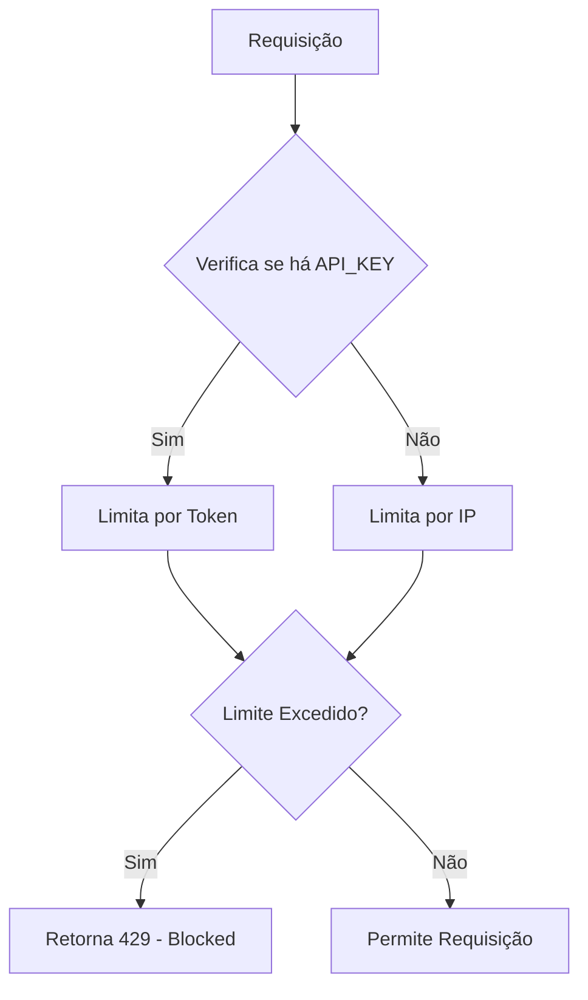

# goThrottle

## Golang Study for Rate Limiter
Este é um rate limiter implementado em Go para controlar o tráfego de requisições baseado em IP ou token de acesso, usando Redis como backend de persistência.

## Como Funciona

O rate limiter funciona como um middleware, verificando se o número de requisições por IP ou token de acesso excede os limites configurados.

- **Limitação por IP**: Se um IP exceder o número máximo de requisições por segundo, ele será bloqueado por um tempo configurado.
- **Limitação por Token**: Se um token exceder o número máximo de requisições por segundo, ele será bloqueado.

## Configuração

As variáveis de configuração podem ser definidas no arquivo `.env`:

- `IP_LIMIT`: Número máximo de requisições por segundo por IP.
- `TOKEN_LIMIT`: Número máximo de requisições por segundo por token de acesso.
- `BLOCK_IN_SECONDS`: Duração do bloqueio (em segundos) quando o limite é excedido.
- `REDIS_ADDRESS`: Endereço do Redis (padrão: `localhost:6379`).

## Instruções para Execução

1. Clone o repositório.
2. Crie um arquivo `.env` conforme as configurações desejadas.
3. Execute `docker-compose up` para iniciar a aplicação e o Redis.
4. Acesse a aplicação em `http://localhost:8080`.

## Diagrama de Fluxo

